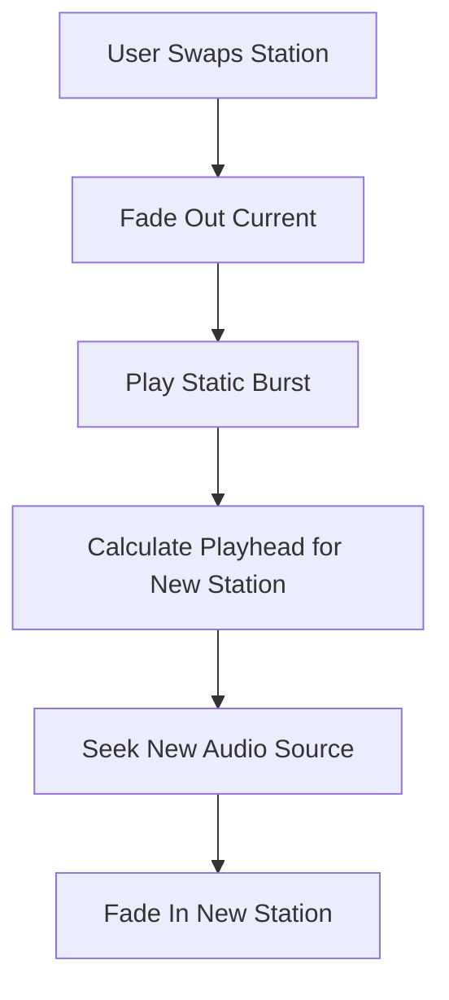

# gta-radio: Concept and Architecture

This document explains the core principles and mechanics of the **GTA-Style Radio Web App**. It is intended for developers who wish to recreate the experience on different platforms (e.g., iOS, Android, Desktop) or using different technology stacks (e.g., Rust, C++, Swift).

---

## 1. The Vision: Persistent Audio World
The fundamental goal of this application is to simulate a **live broadcast environment**. Unlike a standard music player where a track starts from the beginning when selected, this app assumes the radio station is "always running" in the background, even when you aren't listening.

### Key Experience Goals:
- **Synchronization**: Every listener (or every time you tune back in) should hear the same part of the song relative to a global clock.
- **Immersion**: Switching stations shouldn't be a clean digital cut. It should feel like hardware—complete with static interference and volume ramps.
- **Spatial UI**: Selection is handled via a radial wheel, emphasizing the variety and "physicality" of the radio dial.

---

## 2. Core Mechanic: The Virtual Playhead
The "Magic" of the persistent radio is the **Virtual Playhead**. Instead of storing the current seek position of every station, we calculate it on-the-fly using a reference point in time.

### The Algorithm
1.  **Epoch**: Define a fixed timestamp in the past (e.g., `2026-01-01T00:00:00Z`).
2.  **Current Time**: Get the current system time in seconds.
3.  **Elapsed**: `Elapsed = CurrentTime - Epoch`.
4.  **Seek Position**: `Seek = Elapsed % StationDuration`.

> [!TIP]
> This allows the app to be completely stateless regarding track progress. If you close the app and reopen it, the calculation ensures you land exactly where "the broadcast" would be.

---

## 3. The Audio Transition Layer
To maintain immersion during station changes, the app implements a multi-stage transition.

### Stages of a Transition:
1.  **Out-Ramp**: Fade the current station volume to zero rapidly (~60ms) to avoid pops.
2.  **Static Burst**: Play a short, procedural white-noise burst (~300ms). This masks the loading of the new audio file.
3.  **Seek & Prep**: Calculate the Virtual Playhead for the *new* station and seek the audio buffer to that position while the volume is still muted.
4.  **In-Ramp**: Once the new station is "Ready to Play," ramp the volume back up to the user's setting (~400ms).

---

## 4. UI/UX Principles: The Radial Wheel
The interface mimics the "Radical Selection" pattern found in modern action games.

- **Non-Linear Selection**: Stations are arranged in a circle. Moving the "selector" involves calculating an angle rather than a list index.
- **Visual Feedback**: The entire UI background glows with the theme color of the *hovered* station to provide immediate context before selection.
- **Now Playing HUD**: A temporary information card that slides in only when the station changes or a new track starts.

---

## 5. Technical Requirements for Re-implementation
To accurately recreate this app, your chosen platform must support:

- **High-Precision Clock**: Access to a monotonic or system clock with millisecond precision.
- **Non-Blocking Audio Seeking**: Ability to "Seek" an audio file to a specific timestamp before playing.
- **Gain/Volume Control Nodes**: A way to apply linear or exponential volume ramps (important for the transition layer).
- **Procedural Audio (Optional but Recommended)**: The ability to generate white noise programmatically rather than playing a static `.wav` file ensures the "Static Burst" always sounds unique.

---

## 6. Logic Flow Chart

